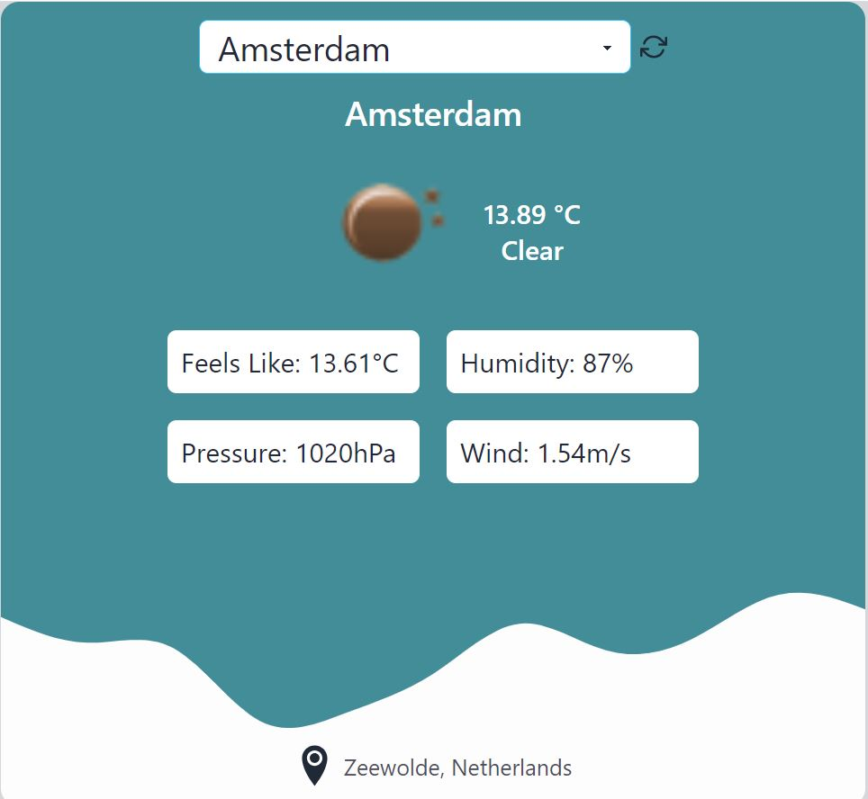

# Weather Web App



## Table of Contents

- [Description](#description)
- [Features](#features)
- [Technologies Used](#technologies-used)
- [Requirements](#requirements)
- [Installation](#installation)
- [Usage](#usage)
- [Contributing](#contributing)
- [License](#license)

## Description

The Weather Web App is a responsive web application that provides users with current weather information for selected cities. It uses the OpenWeather API to retrieve weather data and the IP Stack API to detect the user's location.

### Features

- **City Selection:** Users can choose from a list of predefined cities, including London, Amsterdam, Moscow, New York, and their default home city.

- **Weather Data Display:** The app displays detailed weather information for the selected city, including temperature, current weather icon, weather description, pressure, wind speed, "feels like" temperature, and humidity.

- **Data Refresh:** Users can easily refresh the page to obtain the latest weather data for the selected city.


## Technologies Used

- **React.js with Next.js:** For server-side rendering and building the user interface.
- **TypeScript:** For type-safe and reliable development.
- **Tailwind CSS:** For responsive and adaptive styling.
- **OpenWeatherMap API:** To retrieve weather information.
- **IP Stack API:** To detect the user's location. [IP Stack Documentation](https://ipstack.com/documentation)

## Requirements

To contribute to or run this project locally, ensure that you have the following:

- fetch.
- Style libraries for creating a responsive design.
- TypeScript for type safety.
- Storage for data about the selected city.
- Next.js for server-rendered React applications.
- IP Stack API for location detection.
- OpenWeatherMap API for weather information. [OpenWeatherMap API](https://openweathermap.org/)

## Installation

Follow these steps to set up the Weather Web App locally:

1. Clone the repository:

   ```bash
   git clone https://github.com/SaraYaraghtala/Weather-App-Task
 
